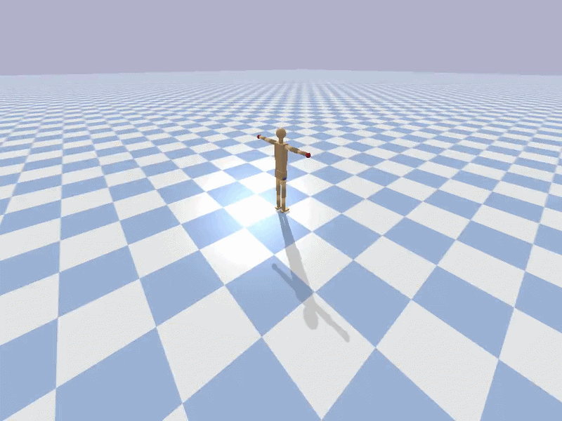

# Kick-Boxing RL Agent with SMPL-X Humanoid

Reinforcement learning framework for training a kick-boxing agent using a physics-simulated SMPL-X humanoid character in PyBullet. The pipeline has two phases: (1) pre-train a motion prior from SMPL-X mocap data, then (2) train a PPO agent in a kick-boxing environment that leverages the learned motion prior for natural movement.

---

## Project Structure

```
kick-boxing/
├── configs/
│   └── default.yaml            # All hyperparameters (env, reward, pretrain, RL)
├── envs/
│   ├── __init__.py              # Gymnasium registration (KickBoxing-v0)
│   └── kickboxing_env.py        # PyBullet + Gymnasium environment
├── models/
│   ├── urdf/
│       └── humanoid_smplx.urdf  # 22-joint SMPL-X humanoid (URDF)
├── utils/
│   ├── config.py                # YAML config loader
│   ├── math_utils.py            # Quaternion math, COM, rotation utilities
│   ├── mocap_loader.py          # SMPL-X mocap dataset (PyTorch Dataset)
│   └── rewards.py               # Multi-component reward function
├── scripts/
│   ├── train.py                 # Main entry point (pretrain + RL)
│   ├── evaluate.py              # Evaluate trained agent with metrics
│   └── visualize_urdf.py        # Quick URDF visualization in PyBullet GUI
├── logs/                        # TensorBoard logs (auto-created)
├── requirements.txt
├── setup.py
└── README.md
```

---

## Requirements

- Python >= 3.9
- CUDA-capable GPU (recommended for training)

### Install

```bash
# Clone and enter project
cd kick-boxing

# Create virtual environment
python -m venv venv
source venv/bin/activate        # Linux/Mac
# or: venv\Scripts\activate     # Windows

# Install dependencies
pip install -r requirements.txt

# Install project in development mode
pip install -e .
```

---

## SMPL-X Humanoid (URDF)

The URDF at `models/urdf/humanoid_smplx.urdf` defines a 22-joint humanoid character following the SMPL-X kinematic tree. Key body parts for kick-boxing:

| Body Part | Links | Joint Type |
|-----------|-------|------------|
| Spine | spine1, spine2, spine3 | Spherical |
| Head | neck, head | Spherical |
| Arms | shoulder, elbow, wrist, hand | Spherical + Revolute |
| Legs | hip, knee, ankle, foot | Spherical + Revolute |

Visualize the model:
```bash
python scripts/visualize_urdf.py

# Walk for 10 seconds (default)
python scripts/simulate_walk.py

# Walk for 20 seconds at 1.5x speed
python scripts/simulate_walk.py --duration 20 --speed 1.5

# Save video (requires ffmpeg)
python scripts/simulate_walk.py --record walk.mp4

# Run fast (no realtime sync)
python scripts/simulate_walk.py --no-realtime
```


**Environment details:**
- Physics: 500 Hz simulation, 50 Hz control
- Observation (dim varies): root pose/velocity, joint positions/velocities, opponent state, contact flags
- Action: normalized joint torques [-1, 1] scaled to max torque
- Two humanoids: agent (trainable) vs opponent (stationary baseline)

**Reward function** (configurable in `configs/default.yaml`):

| Component | Weight | Description |
|-----------|--------|-------------|
| Strike | 5.0 | Reward for landing hits on opponent (head > torso > legs) |
| Balance | 2.0 | Penalizes low COM height and non-upright orientation |
| Energy | -0.01 | Penalizes excessive joint torques |
| Posture | 1.0 | Rewards upright body orientation |
| Alive | 0.5 | Bonus per step for staying upright |
| Fall | -10.0 | Penalty for falling (COM < 0.4m or tilt > 73 deg) |


Metrics reported: mean reward, episode length, strike count, survival rate.

---

## Configuration

All hyperparameters are in `configs/default.yaml`:

```yaml
environment:
  physics_timestep: 0.002       # 500 Hz physics
  control_timestep: 0.02        # 50 Hz control
  max_episode_steps: 1000

reward:
  strike_weight: 5.0
  balance_weight: 2.0
  target_zones:
    head: 3.0                   # Head strikes worth most
    torso: 2.0
    legs: 1.0
                   # Parallel environments
```

---

## Using as a Gym Environment

```python
import gymnasium as gym
import envs  # triggers registration

env = gym.make("KickBoxing-v0")
obs, info = env.reset()

for _ in range(1000):
    action = env.action_space.sample()
    obs, reward, terminated, truncated, info = env.step(action)
    if terminated or truncated:
        obs, info = env.reset()

env.close()
```

## Sample Video

---

## Extending the Project

**Custom opponent policy:** Replace `_apply_opponent_policy()` in `kickboxing_env.py` with a trained policy for self-play.

**Different humanoid:** Replace `humanoid_smplx.urdf` with your own URDF. Update `CONTROLLABLE_JOINTS` and `STRIKE_LINKS` in the environment.

**Additional reward terms:** Add methods to `KickBoxingReward` in `utils/rewards.py` and include them in `compute()`.

**Self-play training:** Load two PPO agents and alternate which one trains while the other acts as the opponent.

---

## Acknowledgments

- [SMPL-X](https://smpl-x.is.tue.mpg.de/) - Expressive body model
- [PyBullet](https://pybullet.org/) - Physics simulation
- [Gymnasium](https://gymnasium.farama.org/) - Environment API
